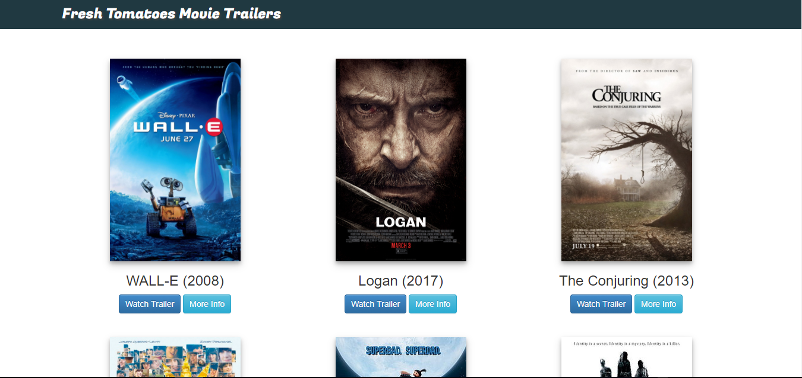
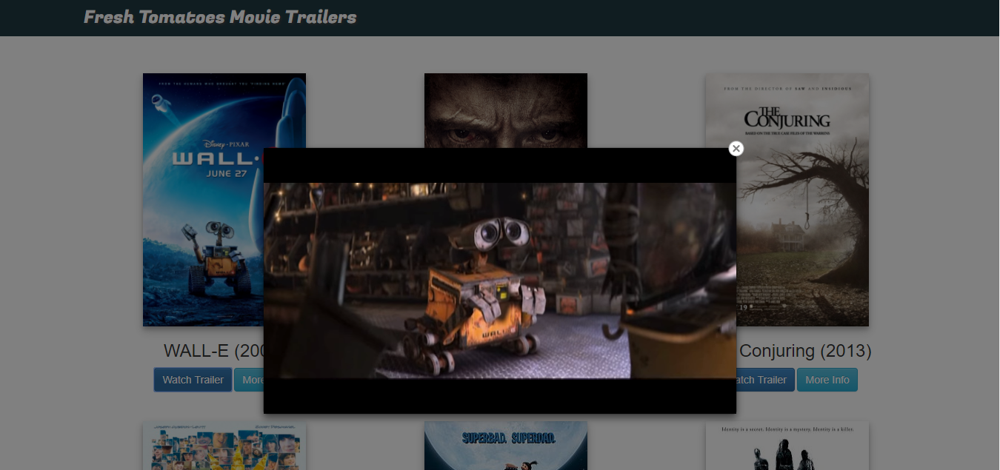
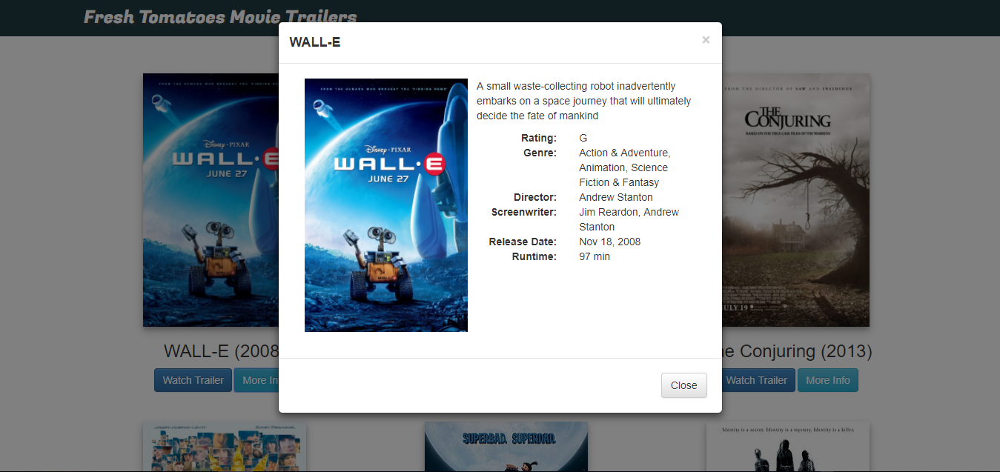
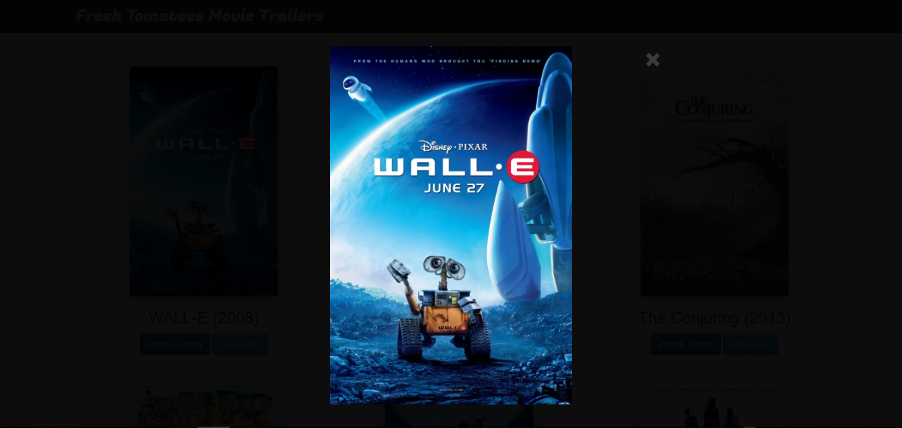

# Movie Trailer Website
by Eileen Wong

## Table of Contents
* [Project Background](#project-background)
* [Project Content](#project-content)
* [Required Libraries and Dependencies](#required-libraries-and-dependencies)
* [Demo](#demo)
* [How to Load](#how-to-load)
* [Project Display Screenshot](#project-display-screenshot)
* [Bugs and Feature Requests](#bugs-and-feature-requests)
* [Resources Used](#resources-used)

## Project Background
This project creates a simple movie website with images and trailers for Udacity Intro to Programming Nanodegree Program.
It demonstrates knowledge of Object Oriented Programming.
For more detailed description and instruction, please visit [Udacity Classroom](https://classroom.udacity.com/nanodegrees/nd000/parts/677b08a4-354a-4166-a245-7c1d359a7026/modules/132e7ed4-dbf2-4f57-8714-95a171750a21/lessons/6cdcc774-708a-4fbc-b0da-e882671f1578/concepts/eaf8a1e6-5ce4-4ccc-a9cc-1a258c157600).

## Project Content
This project contains following files:
- index.html
- entertainment_center.py: main Python script
- fresh_tomatoes.py: generates index.html for website
- media.py: contains Movie class
- screenshot file: containing screenshot of the game
- README.md: explanation of the game

## Required Libraries and Dependencies
Python 2.x is required to run this project.

## Demo
Check out final product [here](https://eileenwong9305.github.io/movie-trailer-website/).

## How to Load
1. Download the project zip file to your pc and unzip the file. Or clone the repo to your pc.
2. Install Python version 2.7 if necessary.
3. Run entertainment_center.py in command line using command `python entertainment_center.py`.
4. `fresh_tomatoes.html` will be generated and webpage will be automatically opened in browser.

## Project Display Screenshot
The movie trailer website project consists of server-side code to store a list of movies titles, along with its respective movie poster, movie trailer and other information. The webpage allow visitors to watch trailer and get detailed information about the movies.

Simple home page where movies are laid out

Users can click on "Watch Trailer" to watch trailer.

Users can click on "More info" button to see more detailed information about the movie.

Clicking on the movie poster allow to view the enlarged poster.

## Bugs and Feature Requests
If there is a bug or feature request, please open an [issue](https://github.com/eileenwong9305/movie-trailer-website/issues/new).

## Resources Used
### Movie Posters:
- <https://www.wikipedia.org/>

### Movie Information:
- <https://www.rottentomatoes.com/>

### Modal:
- <https://v4-alpha.getbootstrap.com/components/modal/>

### Bootstrap
- <https://netdna.bootstrapcdn.com/bootstrap/3.1.0/css/bootstrap-theme.min.css>
- <https://netdna.bootstrapcdn.com/bootstrap/3.1.0/js/bootstrap.min.js>

### jQuery
- <http://code.jquery.com/jquery-1.10.1.min.js>
